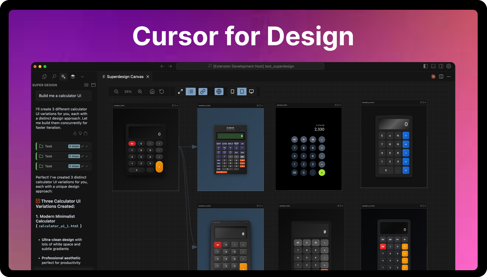
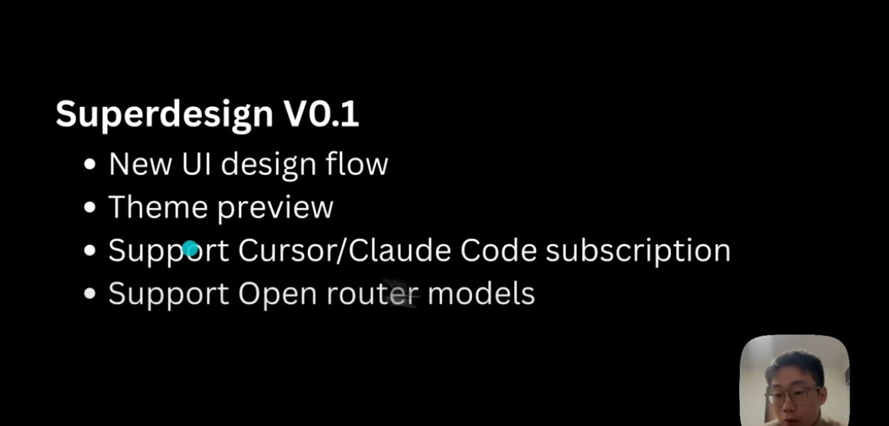

# 🧠 SuperDesign — AI Design Agent for Your IDE

**🆕 New:** [SuperDesign Chrome Extension](https://chromewebstore.google.com/detail/obpjaonipoaomjnokbimppohbpjibflm) - Clone any website & UI

---

### **By:** [AI Jason](https://x.com/jasonzhou1993)

SuperDesign is the first **open-source design agent** that lives right inside your IDE.  
Generate UI mockups, components, and wireframes directly from natural language prompts.  
Works seamlessly with Cursor, Windsurf, Claude Code, and plain VS Code.

> ✨ "Why design one option when you can explore ten?" — SuperDesign

[Join discord](https://discord.gg/FYr49d6cQ9)

[Upvote on Hackernews](https://news.ycombinator.com/item?id=44376003)

[Install guide](https://www.superdesign.dev/ide-extension)

---

## 🎬 Demo Video (Click to play)

---

## 🚀 Features

- 🖼️ **Product Mock**: Instantly generate full UI screens from a single prompt
- 🧩 **UI Components**: Create reusable components you can drop into your code
- 📝 **Wireframes**: Explore low-fidelity layouts for fast iteration
- 🔁 **Fork & Iterate**: Duplicate and evolve designs easily
- 📥 **Prompt-to-IDE**: Copy prompts into your favorite AI IDE (Cursor, Windsurf, Claude Code)

---

## 🧠 Works Great With Cursor, Windsurf, Claude Code, VS Code

👉 [Install here](https://www.superdesign.dev/ide-extension)

---

## 🛠️ Getting Started

1. **Install the Extension** from the Cursor/VS Code Marketplace
2. Open the `SuperDesign` sidebar panel
3. Type a prompt (e.g., _"Design a modern login screen"_)
4. View generated mockups, components, and wireframes
5. Fork, tweak, and paste into your project

---

## Can I use my own Claude Code or Cursor subscription?
Yes, after you initialise superdesign extension, some cursor/claude code rules will be added, so you can prompt the agent to do design and preview in superdesign canva (cmd + shift + p -> superdesign: open canva)

If using Cursor - I will highly suggest copy the prompt in 'design.mdc' and create a custom mode in cursor with that same system prompt; This should give you much better performance

Instructions here (Click to play): 

## How to run local OpenAI compatible servers?
1. Select open ai on Ai Model Provider
2. Put anything in Openai Api Key input
3. Add your OpenAi Url on the Openai Url input (example: http://127.0.0.1:1234/v1 for LM Studio)

## 📂 Where Are My Designs Stored?

Your generated designs are saved locally inside `.superdesign/`.

---

## ❓ FAQ

**Is it free and open source?**  
Yes! We are open source — fork it, extend it, remix it.

**Can I customize the design agent?**  
Yes — use your own prompt templates, modify behaviors, or add commands.

**Can SuperDesign update existing UI?**  
Absolutely — select a component, describe the change, and let the agent do the rest.

**How can I contribute?**  
Pull requests are welcome. Star the repo and join us on [Discord](https://discord.gg/XYZ)!

---

## 🔗 Links

- 🌐 Website: [https://superdesign.dev/ide-extension](https://superdesign.dev/ide-extension)
- 📦 GitHub: [https://github.com/superdesigndev/superdesign](https://github.com/superdesigndev/superdesign)
- 💬 Discord: [Join the Community](https://discord.gg/XYZ)
- 🐦 Twitter / X: [@SuperDesignDev](https://x.com/SuperDesignDev)

